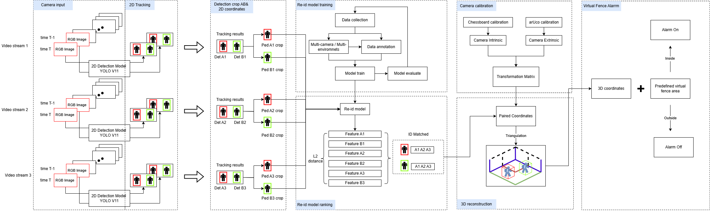

# 3d_detection

项目总架构

2d detector: yolov11
2d tracker : deepsort
reid: torchreid

preprocessing_tools.py: 见相机录制手册
MultiCameraCapture： 管理多个相机(内参/外参)
HumanPoseObject: 管理2d det结果
HumanPoseObject_3d: 管理3d 结果

todo: different track different color
